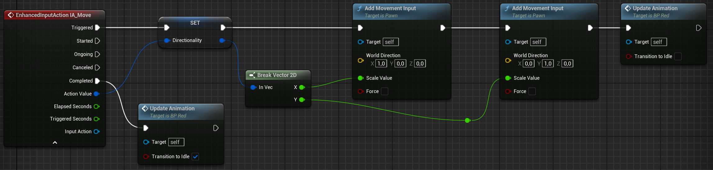
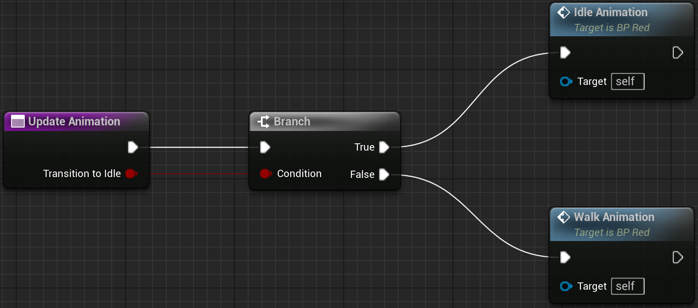
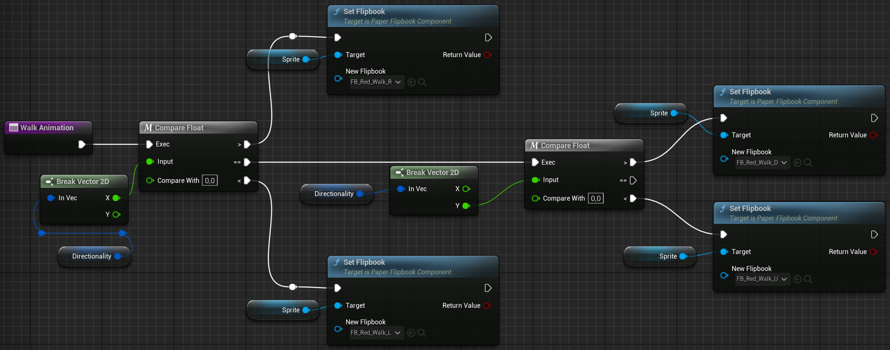
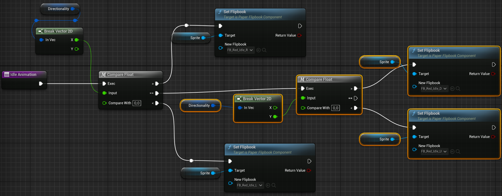

# Logica base delle animazioni
La logica base per le animazione, sulla quale si basa PaperZD, consiste nel lavorare nel BP del personaggio. Si agisce sulla struttura per il movimento del personaggio [**EnachedInputAction**](Input.md#Specifiche-delle-varie-componenti-citate). Dividiamo l'animazione del movimento in **Animazione di Direzione** e **Animazione di Movimento** entrambe all'interno della medesima funzione di **Update Animation** che conteine a sua volta la funzione **Idel Animation** per l'Animazione di direzione e la funzione **Walk Animation** per l'Animazione di Movimento. Sruttiamo la variabile bool **Transation to Idle** per capire quale animazione attivare.

  
 <b>Uso della funzione Update Animation</b> 

  

  
 <b>Definizione della funzione Update Animation</b> 

  

## **Animazione di Movimento** nella funzione **Walk Animation**
Imposta il **FlipBook** di camminata corretto nel momento in cui l'input è **Triggered** (alla fine però della logica del movimeto).

  
 <b>Definizione della funzione Walk Animation</b> 

  

## **Animazione di Direzione** nella funzione **Idel Animation**
Imposta il **FlipBook** di camminata corretto nel momento in cui l'input è **Completed**.

  
 <b>Definizione della funzione Walk Animation</b> 

  

 

In entrambi i casi sfruttiamo la variabile **Direzione** per capire quale specifico FlipBook impostare:
- Dividiamo la direzione in **X**,**&Y**.
- Compariamo i valori di X e Y rispetto allo 0.
- Aggiorniamo corretamento il FLipBook tramite Set FlipBook

 

# Animazioni in PaperZD
Innanzitutto bisogna creare una fonte per le risorse. Creaiamo un **Animation Source** nella cartella in cui abbiamo il blueprint di un certo specifico personaggio. All'interno dell'AS aggiungiamo una nuova animazione per ogni tipo che ci interessa e da li impostiamo nell'Assets Details i flipbook per ogni direzione utile. Questo per ogni cosa richiede un'animazione con flipbook.

## Specifiche delle varie componenti citate

- **Animation Source**
Funge da tabella di lookup che mappa gli stati di animazione generici (es. 'Idle') agli asset Flipbook specifici, permettendo di disaccoppiare la logica (AnimBP) dagli asset grafici.  
Per aggiungere nuove animazioni basta cliccare su Add New