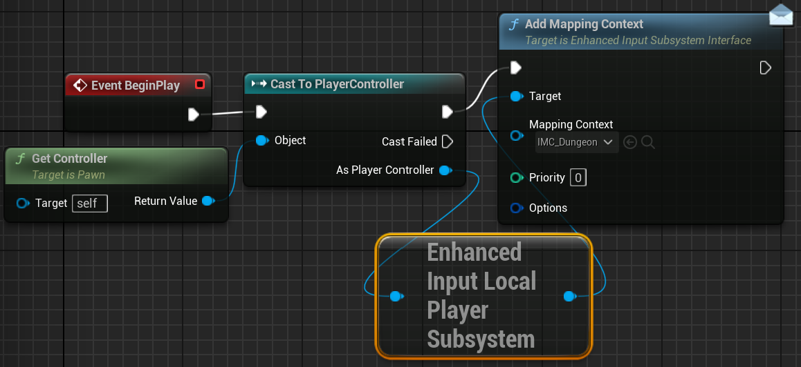

# Gestione degli Input

### Creazione componenti per la gestione degli input
Nella cartella dedicata agli input Creaimo la cartella Actions in cui aggiungiamo una Input Action dove impostiamo il **Value Type** in **Axis2D**. Ora nella cartella input creiamo un **Input Mapping Context** e qui creaiamo un **Mappings** in cui selezioniamo l'Input Actions che ci interessa e da li impostiamo i diversi tasti che devono essere mappati e i dettagli per ogni tasto come i **Modifiers**.

### Inizializzazione dei componenti per il movimento del personaggio
Successivamnete nell'event graph del blueprint del character che deve reagire agli input e partiamo a collegare da **Event BeginPlay**. Aggiungiamo  **Get Controller** / **Cast To Player Controller** / **Enhanced Input Local Player Subsystem** / **Add Mapping Context**

- **Input Actions**
Agisce come un contenitore che dice al motore se l'input è un semplice click (on/off) o un movimento complesso (coordinate X/Y).

- **Input Context Mapping**
Mappa i tasti fisici (es. WASD, Gamepad) alle Input Action logiche, applicando modificatori (es. inversione assi) e permettendo di scambiare interi schemi di controllo dinamicamente (es. A piedi vs Veicolo).

- **Modifiers**
Per i comandi WASD impostiamo questi modifiers:
    - D -> **No Mod**
    - A -> **Negate**
    - S -> **Swizzle Input Axis Values**
    - W -> **Swizzle Input Axis Values**, **Negate**