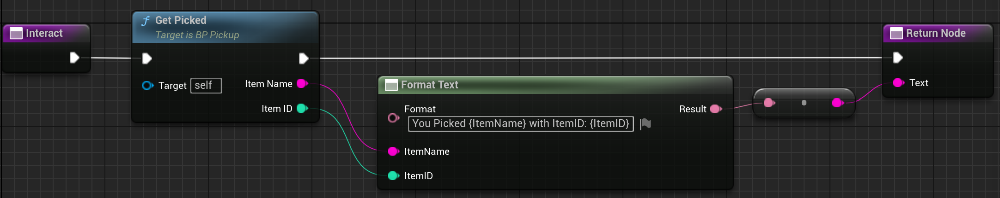

# Creazione ed uso delle Interfacce
Creaimo nella cartella **Interfaces** un **Blueprint Interface** in definiamo una funzione che avrà un input e un output. Nell'esempio sarà l'interfaccia per le interazione e che contrà la funzione **Interac**. L'Interfaccia andrà implementata da ciascun blueprint che voglimo sia interaggibile, per questo andremo nei **Details** del blueprint, **Class Settings** e aggiungiamo l'interfaccia appena creata con la successiva implementazione della funzione. Invece che richiama l'interfaccia perchè richiede un comportamento a chi può soddisfarlo richiama l'interfaccia specifica nel **Blueprint** dell'interafcia creato prima.

Di seguito l'utilizzo di un'interfaccia nell'esempio della raccolta di un oggetto.

  
 <b>Logica Base di Pickup</b> 

  

  - **Does Object Implement Interface** si spiega da solo.
  - **Interac** è la funzione dell'interfaccia che viene richiamata. 
  - **Tutto il resto** è la logica di raccolta dell'oggetto.

  
 <b>Logica Base di Pickup</b> 

  

  - Implementazione della funzione dell'interfaccia nel blueprint dell'oggetto.
  - **Get Picked** è la funzione che contiene la logica di raccolta dell'oggetto. In questo caso distrugge solo l'oggetto e ritorna i valori necessari.

