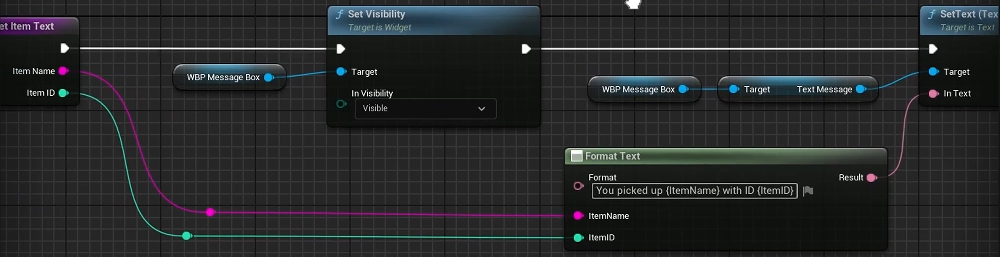
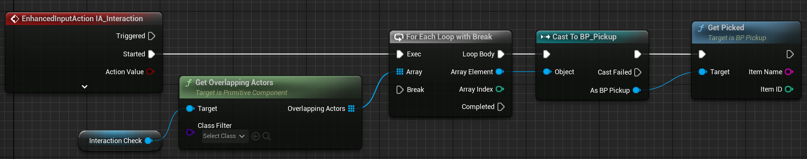

# UI dei messaggi base

## Componente di creazione del messaggio / Widget figlio tipo
Creaiamo nella cartella **Widgets** un **Widget Blueprint** -> **User Widget**. Il blueprint conterrà il **Graph** e il **Designer**.

Nel **Designer** usaremo per "Ottimizzazione" un **Border** come elemento del **Root Widget** e lo impostiamo così:
- In **Brush** impostemo come immagine la **Texture** che vogliamo usare come sfondo del messaggio.
- **Draw As** -> **Box**.
- **Margin** impostiamo i valori che riteniamo migliori.
- **Screen Size** -> **Desired** e regoliamo il **Padding** in base alla grandezza del messaggio che vogliamo visualizzare.

Successivamente aggiungiamo un **Text** in **Child Hierarchy** del **Border** a cui possiamo impostare un **Font**, **Color and Opacity** ecc.. Inoltre impostiamo ***Auto Wrap Text** per evitare che il testo esca fuori dal bordo.
In questa schermata impostiamo**Is Variable** per il **Text** in modo da poterlo modificare successivamente nel **Graph**.

## Modulo padre di widget
Creaiamo un nuovo **Widget Blueprint** come prima. Qui Inseriamo un **Canvas Panel** come **Root Widget** e successivamnete il **widget** precedentemente creato che spunteremo come **Is Variable** in questa scheramata. Impostiamo la visibilità del **Widget** su **Hiden** così che basterà rimpostarla su **visibile** nel **BP** per farla riapparire. Usiamo gli **Anchors** per posizionare il messaggio dove vogliamo e aggiustamo **Position**, *Size**, **Offset** ecc.. come vogliamo.

In **Graph** crearemo le funzioni per la gestione del messaggio. Nell'esempio vediamo **SetItemText**. 

  
 <b>Logica della funzione SetItemText</b> 

  

  - Aggiungiamo gli input necessari alla funzione **SetItemText** e li impostiamo con **Instance Editable** per avere facilmente più oggetti copiandoli e modificando solo i parametri.
  - Accediamo a **Set Visibility** tramite la variabile **Widget figlio**.
  - Accediamo a **Set Text** tramite la variabile **Text**, tramite la variabile **Widget figlio**.

## Usare i widget nel gioco
Nel **Blueprint** di ciò che attiva il messaggio, aggiungiamo un **Create Widget** e selezioniamo il widget padre creato. Successivamente aggiungiamo un **Add to Viewport** e colleghiamo il **Return Value**. Per non perdere l'accesso al widget creato, creiamo una variabile a partire dal rteturn value.

# Basic Pickable Item
Creaiamo nella cartella **Items** un **Actor Blueprint** dove andiamo ad aggiungere un **Paper Sprite** al **Root Component**. Per l'interattività utilizeremo un **Box Collision** per questo aggiungiamo come **Child Component** una **Box Collision** e lo posizioniamo in modo da coprire l'oggetto. 

Aggiungiamo un **Box Collision** anche nella **Capsule Component** del **Character** per rilevare la collisione tra il personaggio e gli oggetti. 
//TO-DO: **Aggiungere la logica per il cambio di posizione della box collision del personaggio in base alla direzione del movimento.**

(Per la raccolta degli oggetti avremo bisognno di creare un nuovo **Input Action** e un nuovo **Input Mapping Context** come spiegato nella sezione degli [Input](Input.md.Gestione-degli-Input))

Aggiungiamo nel **BP* del personaggio il nuovo *Enhanced Input Action** e colleghiamo il **Started** (Non il **Triggered**) ai blocchi per la logica di raccolta. 

  
 <b>Logica Base di Pickup</b> 

  
  

  - **Interation Check** è il **Box Collision** del personaggio.
  - **Get Overlapping Actors** per ottenere tutti gli attori che sono in collisione con il personaggio.
  - **For Each Loop with Break** serve ciclare tutti gli attori precendenti. Il **Break** verrà collegato con l'ultimo blocco così da fermare il ciclo quando troviamo un attore che soddisfa le condizioni. Questo previene di raccogliere più oggetti contemporaneamente.
  - **Cast to "Item Blueprint"** per considerare solo gli attori di quel tipo.
  - **"Funzione di Pickup"** funzione per la logica dell'oggetto raccolto nel **BP** dell'oggetto.
  - **Set Item Text** funzione per impostare il testo del messaggio in **Widget** padre.
  - **Retriggerable Delay** per per sparire il messagio dopo un certo tempo. Con questo delay evitiamo che i messagi si sovrappongano e che il messaggio sparisca subito dopo la raccolta dell'oggetto.
  - **Hide Message Visibility** è solo una variabile che contiene il dempo di delay.
  - **Hide Message** funzione per nascondere il messaggio nel **Widget** padre.

# PNG
Creare un **Paper Character** nella cartella **Characters**, impostiamo lo **Sprite** e gli creaimo una funzione **Get Dialogue Line** che ritorna una **String**. 